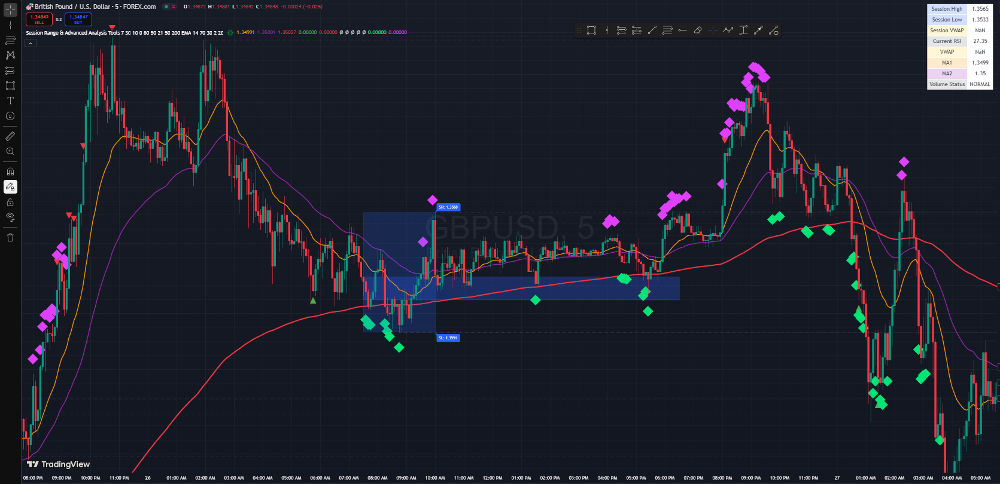

# Session Range & Advanced Analysis Tools

A comprehensive Pine Script v5 indicator that combines session-based analysis with multiple highly trusted technical indicators to provide professional-grade trading signals and confluence detection.



## 📋 Table of Contents

- [Overview](#overview)
- [Features](#features)
- [How It Works](#how-it-works)
- [Installation](#installation)
- [Configuration](#configuration)
- [Indicator Components](#indicator-components)
- [Trading Strategies](#trading-strategies)
- [Visual Elements](#visual-elements)
- [Alerts & Signals](#alerts--signals)
- [Best Practices](#best-practices)
- [Troubleshooting](#troubleshooting)
- [Version History](#version-history)

## 🎯 Overview

This indicator is designed for **day traders** and **swing traders** who want to:
- Identify key session levels (high/low ranges)
- Use multiple confirmation signals for trade entries
- Detect confluence zones where multiple indicators align
- Get professional-grade analysis tools in one comprehensive package

**Recommended Timeframes:** 1m, 5m, 15m, 1H
**Best Markets:** Forex, Indices, Crypto, Stocks

## ✨ Features

### Core Components
- **Session Range Detection** - Automatically identifies and marks trading session high/low levels
- **Moving Averages** - Three configurable MAs (21, 50, 200 default) with multiple types
- **RSI Analysis** - Momentum detection with overbought/oversold signals
- **VWAP Integration** - Volume-weighted average price with deviation bands
- **Support/Resistance** - Automatic pivot point detection and level extension
- **Volume Analysis** - High volume detection and confirmation
- **Confluence Detection** - Smart algorithm identifying high-probability setups

### Advanced Features
- **Session-Specific VWAP** - Calculates VWAP only for defined session periods
- **Multi-Timeframe Analysis** - Works across different timeframes
- **Real-Time Analysis Table** - Live display of all key metrics
- **Professional Alerts** - Multiple alert conditions for different scenarios
- **Customizable Visuals** - Full control over colors, opacity, and display options

## 🔧 How It Works

### 1. Session Detection
The indicator monitors time-based sessions using hour/minute inputs:
```
Session Start: 07:30 (default)
Session End: 10:00 (default)
```

During each session, it tracks:
- **Session High** - Highest price reached
- **Session Low** - Lowest price reached  
- **Session Volume** - Total volume traded
- **Session VWAP** - Volume-weighted average for the session

### 2. Technical Analysis Integration
Multiple indicators work together to provide confluence:

**Moving Averages:**
- Fast MA (21) - Short-term trend
- Medium MA (50) - Intermediate trend  
- Slow MA (200) - Long-term trend/major support-resistance

**RSI (Relative Strength Index):**
- Detects momentum shifts
- Signals when price exits overbought (>70) or oversold (<30) zones
- Provides early reversal warnings

**VWAP (Volume Weighted Average Price):**
- Shows institutional trading levels
- Acts as dynamic support/resistance
- Includes standard deviation bands for volatility context

**Support/Resistance:**
- Automatically detects pivot points
- Extends key levels into the future
- Helps identify potential reversal zones

### 3. Confluence Detection Algorithm
The system identifies high-probability setups when multiple conditions align:

**Bullish Confluence:**
```
- Price near session low
- AND (Price near VWAP OR near moving average)
- AND RSI below 40
```

**Bearish Confluence:**
```
- Price near session high  
- AND (Price near VWAP OR near moving average)
- AND RSI above 60
```

## 📥 Installation

### TradingView Installation
1. Open TradingView chart
2. Click "Pine Editor" at bottom
3. Delete existing code
4. Paste the indicator code
5. Click "Add to Chart"
6. Configure settings as needed

### Recommended Chart Setup
- **Timeframe:** 5m or 15m for day trading
- **Session:** Set to your market's main trading hours
- **Volume:** Enable volume bars for confirmation
- **Clean Chart:** Remove unnecessary indicators to avoid clutter

## ⚙️ Configuration

### Session Settings
| Parameter | Default | Description |
|-----------|---------|-------------|
| Session Start Hour | 7 | Hour when session begins (24h format) |
| Session Start Minute | 30 | Minute when session begins |
| Session End Hour | 10 | Hour when session ends |
| Session End Minute | 0 | Minute when session ends |
| Extend Lines | true | Whether to extend session levels |
| Max Bars Extend | 50 | How far to extend lines |

### Moving Average Settings
| Parameter | Default | Options | Description |
|-----------|---------|---------|-------------|
| Show Moving Averages | true | true/false | Display MAs on chart |
| MA1 Length | 21 | 1-500 | Fast MA period |
| MA2 Length | 50 | 1-500 | Medium MA period |
| MA3 Length | 200 | 1-500 | Slow MA period |
| MA Type | EMA | SMA/EMA/WMA | Type of moving average |

### RSI Settings
| Parameter | Default | Range | Description |
|-----------|---------|-------|-------------|
| Show RSI Levels | true | true/false | Display RSI signals |
| RSI Length | 14 | 1-100 | RSI calculation period |
| RSI Overbought | 70 | 50-100 | Overbought threshold |
| RSI Oversold | 30 | 0-50 | Oversold threshold |

### VWAP Settings
| Parameter | Default | Description |
|-----------|---------|-------------|
| Show VWAP | true | Display VWAP line |
| Show VWAP Bands | true | Display standard deviation bands |
| VWAP Standard Deviation | 2.0 | Multiplier for bands |

### Visual Settings
| Parameter | Default | Range | Description |
|-----------|---------|-------|-------------|
| Range Box Opacity | 80 | 0-100 | Session box transparency |
| Show Labels | true | true/false | Display price labels |
| Show Key S/R Levels | true | true/false | Display support/resistance |
| S/R Lookback Period | 20 | 5-100 | Bars to look back for pivots |
| Max S/R Lines | 20 | 5-50 | Maximum S/R lines to display |

### Advanced Settings (v2.0)
| Parameter | Default | Range | Description |
|-----------|---------|-------|-------------|
| Use ATR-Based Thresholds | true | true/false | Enable dynamic ATR thresholds |
| ATR Length | 14 | 1-100 | ATR calculation period |
| ATR Threshold Multiplier | 0.5 | 0.1-5.0 | Sensitivity adjustment |
| Minimum Confluence Score | 60 | 0-100 | Minimum score to show signals |
| Show Confluence Score | true | true/false | Display score on signals |
| Show RSI Divergence | true | true/false | Enable divergence detection |
| Divergence Lookback | 5 | 3-20 | Bars to look back for divergence |

### Multi-Timeframe Settings
| Parameter | Default | Description |
|-----------|---------|-------------|
| Enable MTF Trend Filter | true | Enable higher timeframe analysis |
| Higher Timeframe | 60 (1H) | Timeframe for trend filter |

### Risk Management Settings
| Parameter | Default | Range | Description |
|-----------|---------|-------|-------------|
| Show Risk Levels | true | true/false | Display SL/TP lines |
| Risk/Reward Ratio | 2.0 | 1.0-10.0 | Target R:R ratio |
| ATR Stop Multiplier | 1.5 | 0.5-5.0 | Stop distance multiplier |

### Multiple Sessions Settings
| Parameter | Default | Description |
|-----------|---------|-------------|
| Enable Multiple Sessions | false | Track Asian/London/NY sessions |
| Asian Start Hour | 0 | Asian session start (24h format) |
| Asian End Hour | 8 | Asian session end |
| London Start Hour | 8 | London session start |
| London End Hour | 16 | London session end |
| NY Start Hour | 13 | NY session start |
| NY End Hour | 22 | NY session end |

### Liquidity Settings
| Parameter | Default | Range | Description |
|-----------|---------|-------|-------------|
| Show Liquidity Zones | true | true/false | Display liquidity sweeps |
| Liquidity Lookback | 50 | 20-200 | History to track for sweeps |

## 📊 Indicator Components

### 1. Session Range Box
- **Blue rectangle** marking session high and low
- **Dashed lines** extending levels to the right
- **Labels** showing exact price levels
- **Opacity control** for visual preference

### 2. Moving Averages
- **Orange line** - Fast MA (21 period)
- **Purple line** - Medium MA (50 period)  
- **Red line** - Slow MA (200 period)
- **Dynamic support/resistance** levels

### 3. VWAP System
- **Yellow line** - Main VWAP
- **Yellow bands** - Standard deviation channels
- **Filled area** between bands for clarity
- **Session VWAP** - Specific to trading session

### 4. RSI Signals
- **Green triangle up** - RSI exit from oversold
- **Red triangle down** - RSI exit from overbought
- **Below/above bars** for clear visibility

### 5. Support/Resistance Levels
- **Gray dotted lines** - Historical pivot levels
- **Automatic detection** - No manual drawing required
- **Extended lines** - Project into future price action

### 6. Volume Analysis
- **Background highlighting** - High volume bars
- **Orange background** - Above average volume
- **Gray background** - Normal volume

### 7. Confluence Signals
- **Green diamond** - Bullish confluence detected
- **Purple diamond** - Bearish confluence detected
- **Large size** - High importance signals

### 8. Analysis Table
Real-time display showing:
- Session High/Low prices
- Current RSI value
- VWAP level
- Moving average values
- Volume status

## 📈 Trading Strategies

### Strategy 1: Session Breakout
**Setup:**
1. Wait for session range to be established
2. Look for breakout above session high or below session low
3. Confirm with volume spike
4. Enter on retest of broken level

**Entry Rules:**
- **Long:** Break above session high + volume confirmation
- **Short:** Break below session low + volume confirmation
- **Stop Loss:** Opposite side of session range
- **Take Profit:** 2:1 or 3:1 risk/reward ratio

### Strategy 2: Confluence Reversal
**Setup:**
1. Wait for confluence signal (diamond)
2. Confirm RSI divergence or extreme reading
3. Look for rejection at key level (VWAP, MA, S/R)
4. Enter on price action confirmation

**Entry Rules:**
- **Long:** Bullish confluence + RSI oversold + support hold
- **Short:** Bearish confluence + RSI overbought + resistance reject
- **Stop Loss:** Beyond confluence zone
- **Take Profit:** Next significant level

### Strategy 3: VWAP Mean Reversion
**Setup:**
1. Price moves away from VWAP (outside bands)
2. RSI shows extreme reading
3. Volume confirms the move
4. Look for return to VWAP

**Entry Rules:**
- **Long:** Price below VWAP lower band + RSI oversold
- **Short:** Price above VWAP upper band + RSI overbought  
- **Stop Loss:** Further extreme of bands
- **Take Profit:** VWAP level or opposite band

### Strategy 4: Moving Average Confluence
**Setup:**
1. Multiple MAs converging or providing support/resistance
2. Price approaching from trending direction
3. Volume and momentum confirming
4. Session levels supporting the direction

**Entry Rules:**
- **Long:** Price above all MAs + pullback to MA support
- **Short:** Price below all MAs + bounce from MA resistance
- **Stop Loss:** Beyond MA cluster
- **Take Profit:** Next session level or significant S/R

## 🎨 Visual Elements

### Color Scheme
- **Blue (#0000FF)** - Session range elements
- **Orange (#FF8C00)** - Fast moving average & high volume
- **Purple (#800080)** - Medium moving average
- **Red (#FF0000)** - Slow moving average
- **Yellow (#FFFF00)** - VWAP elements
- **Green (#00FF00)** - Bullish signals
- **Gray (#808080)** - Support/resistance levels

### Line Styles
- **Solid lines** - Primary indicators (MAs, VWAP)
- **Dashed lines** - Session level extensions
- **Dotted lines** - Support/resistance levels

### Shapes & Markers
- **Triangles** - RSI signals (up/down)
- **Diamonds** - Confluence signals (large)
- **Rectangles** - Session range boxes
- **Labels** - Price level information

## 🔔 Alerts & Signals

### Available Alerts
1. **Bullish Confluence** - Multiple bullish indicators align
2. **Bearish Confluence** - Multiple bearish indicators align  
3. **RSI Oversold** - RSI exits oversold territory
4. **RSI Overbought** - RSI exits overbought territory

### Setting Up Alerts
1. Right-click on chart
2. Select "Add Alert"
3. Choose condition from dropdown
4. Configure notification method
5. Set alert frequency

### Alert Messages
- Clear, descriptive messages
- Include relevant price levels
- Specify confluence type
- Actionable information

## 💡 Best Practices

### Chart Setup
- Use clean chart with minimal distractions
- Enable volume bars for confirmation
- Set appropriate timeframe for your trading style
- Adjust session times to your market

### Risk Management
- Always use stop losses
- Position size based on account risk
- Don't trade against major trend without strong confluence
- Wait for clear signals, avoid FOMO

### Signal Interpretation
- **Multiple confirmations** are stronger than single signals
- **Volume confirmation** increases probability
- **Trend alignment** improves success rate
- **Support/resistance** context is crucial

### Common Mistakes to Avoid
- Trading every signal without discretion
- Ignoring broader market context
- Over-leveraging on confluence signals
- Not waiting for proper confirmations

## 🛠️ Troubleshooting

### Common Issues

**Indicator Not Loading:**
- Check Pine Script version (must be v5)
- Verify all brackets and syntax
- Ensure proper indentation

**Session Times Wrong:**
- Confirm timezone settings
- Adjust for daylight saving time
- Check market hours for your instrument

**No Signals Appearing:**
- Verify input parameters
- Check if indicators are enabled in settings
- Ensure sufficient price history loaded

**Performance Issues:**
- Reduce max bars extend setting
- Disable unused features
- Use appropriate timeframe

### Optimization Tips
- Start with default settings
- Adjust gradually based on results
- Backtest before live trading
- Keep notes on what works

## 🚀 Advanced Features (v2.0)

### ATR-Based Dynamic Thresholds
- **Adaptive Proximity Detection** - Uses ATR (Average True Range) to automatically adjust proximity thresholds based on market volatility
- **Configurable Multiplier** - Fine-tune sensitivity with ATR multiplier (default: 0.5)
- **Better Accuracy** - Works across different volatility environments without manual adjustment

### Advanced Confluence Scoring System (0-100)
- **Weighted Scoring** - Each indicator contributes specific points to overall score
  - Session levels: 20 points
  - VWAP proximity: 15 points
  - Moving averages: 5-10 points each
  - RSI extremes: 10-20 points
  - Volume confirmation: 10 points
  - Divergence: 15 points
  - MTF alignment: 10 points
- **Color-Coded Signals** - Visual strength indication
  - Score ≥80: Bright color (high probability)
  - Score 70-79: Medium color (good probability)
  - Score 60-69: Lighter color (moderate probability)
- **Score Display** - Shows exact score on chart signals
- **Minimum Score Filter** - Configurable threshold (default: 60)

### RSI Divergence Detection
- **Regular Bullish Divergence** - Price makes lower low, RSI makes higher low (reversal signal)
- **Regular Bearish Divergence** - Price makes higher high, RSI makes lower high (reversal signal)
- **Hidden Bullish Divergence** - Trend continuation signal in uptrends
- **Hidden Bearish Divergence** - Trend continuation signal in downtrends
- **Visual Markers** - Circle shapes with "DIV" label
- **Dedicated Alerts** - Separate alerts for divergence detection

### Multi-Timeframe Trend Filter
- **Higher Timeframe Analysis** - Checks 1H trend (configurable)
- **Background Color** - Green tint for HTF uptrend, red tint for HTF downtrend
- **Confluence Integration** - Adds 10 points to confluence score when aligned with HTF trend
- **Prevent Counter-Trend Trades** - Filter out signals against major trend

### ATR-Based Risk Management Module
- **Dynamic Stop Loss** - Calculated as: Current Price ± (ATR × Stop Multiplier)
- **Automatic Take Profit** - Based on configurable Risk/Reward ratio (default: 2.0)
- **Visual Risk Levels** - Dashed lines showing SL and TP on chart
- **Risk Labels** - Display exact SL, TP, and R:R values
- **Adaptive to Volatility** - Stops automatically widen/narrow with market conditions

### Improved Session VWAP Calculation
- **Proper Weighted Average** - Fixed calculation: Sum(Price × Volume) / Sum(Volume)
- **More Accurate** - Better representation of institutional levels
- **Session-Specific** - Resets for each trading session

### Multiple Sessions Support
- **Asian Session** - Default: 00:00 - 08:00
- **London Session** - Default: 08:00 - 16:00
- **New York Session** - Default: 13:00 - 22:00
- **Color Coded** - Each session has distinct color
  - Asian: Blue dotted lines
  - London: Orange dotted lines
  - NY: Purple dotted lines
- **Session Overlaps** - Identify high-liquidity periods
- **Optional Feature** - Enable/disable in settings

### Liquidity Zones & Order Blocks
- **Liquidity Sweep Detection** - Identifies when price sweeps recent highs/lows and reverses
- **Smart Memory** - Tracks last 10 pivot highs and lows
- **Visual Markers** - Yellow X-cross shapes with "LQ" label
- **Institutional Levels** - Highlights areas where stop-losses are likely triggered
- **Entry Opportunities** - Potential reversal zones after liquidity grabs

### Enhanced Visual Trend Strength Indicator
- **MA Alignment Gauge** - Analyzes relationship between price and all MAs
- **6-Level Strength Scale**:
  - Strong Bullish (3): All MAs aligned, price above all
  - Bullish (2): MAs aligned but price near MA1
  - Weak Bullish (1): Price above MA1, MAs not aligned
  - Weak Bearish (-1): Price below MA1, MAs not aligned
  - Bearish (-2): MAs aligned but price near MA1
  - Strong Bearish (-3): All MAs aligned, price below all
- **Color-Coded Display** - Bright green to bright red
- **Analysis Table Integration** - Shows current trend strength

### S/R Line Management System
- **Automatic Cleanup** - Prevents hitting max_lines_count limit
- **Array-Based Storage** - Efficiently manages line objects
- **Configurable Limit** - Max S/R lines (default: 20)
- **FIFO Deletion** - Oldest lines removed first when limit reached
- **Performance Optimized** - No more script crashes from too many lines

### Enhanced Analysis Table
- **12 Metrics Displayed**:
  1. Session High/Low
  2. Session VWAP
  3. Current RSI (color-coded)
  4. Global VWAP
  5. MA1 & MA2 values
  6. Volume Status
  7. **Trend Strength** (new)
  8. **ATR** (new)
  9. **Bullish Confluence Score** (new)
  10. **Bearish Confluence Score** (new)
- **Color-Coded Scores** - Active signals highlighted
- **Real-Time Updates** - Live data on every bar

### Additional Alerts
- **RSI Divergence Alerts** - Bullish and bearish divergence notifications
- **Liquidity Grab Alerts** - When price sweeps and reverses
- **Enhanced Confluence Alerts** - Now include score in message
- **7 Total Alert Conditions** - Comprehensive coverage of all signals

## 📋 Version History

### v2.0 (Current - Optimized)
- ✅ ATR-based dynamic proximity thresholds
- ✅ Advanced confluence scoring system (0-100)
- ✅ RSI divergence detection (regular & hidden)
- ✅ Multi-timeframe trend filter
- ✅ ATR-based risk management module
- ✅ Improved session VWAP calculation
- ✅ Multiple sessions support (Asian/London/NY)
- ✅ Liquidity zones and order blocks detection
- ✅ Enhanced visual trend strength indicator
- ✅ S/R line management system
- ✅ Enhanced analysis table with 12 metrics
- ✅ Additional alert conditions

### v1.0
- Initial release with full feature set
- Session range detection and visualization
- Multiple technical indicators integration
- Basic confluence detection algorithm
- Professional analysis table
- Comprehensive alert system

### Planned Updates
- **v2.1** - Volume profile POC (Point of Control)
- **v2.2** - Fibonacci retracement integration
- **v2.3** - Smart Money Concepts (CHoCH, BOS)
- **v2.4** - Additional MA types (TEMA, HMA, DEMA)

## 📞 Support & Resources

### Documentation
- This README file
- Inline code comments
- TradingView Pine Script documentation

### Community
- TradingView public scripts section
- Pine Script community forums
- Trading education resources

### Updates
- Regular improvements based on user feedback
- Bug fixes and optimizations
- New feature additions

---

**Disclaimer:** This indicator is for educational and informational purposes only. Trading involves substantial risk and is not suitable for all investors. Past performance does not guarantee future results. Always do your own research and consider your risk tolerance before trading.

**License:** This Pine Script indicator is provided as-is. You may modify and distribute it freely, but please maintain attribution to the original creator.

---

*Last Updated: November 16, 2025*
*Version: 2.0 (Optimized)*
*Pine Script Version: v6*